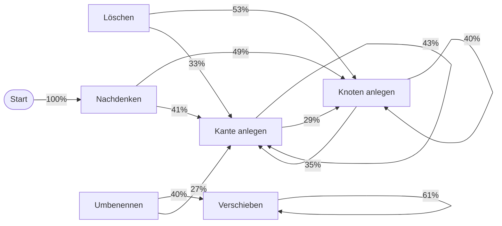
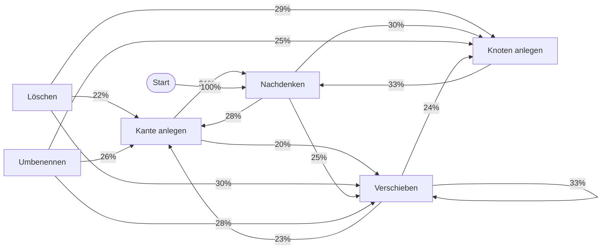
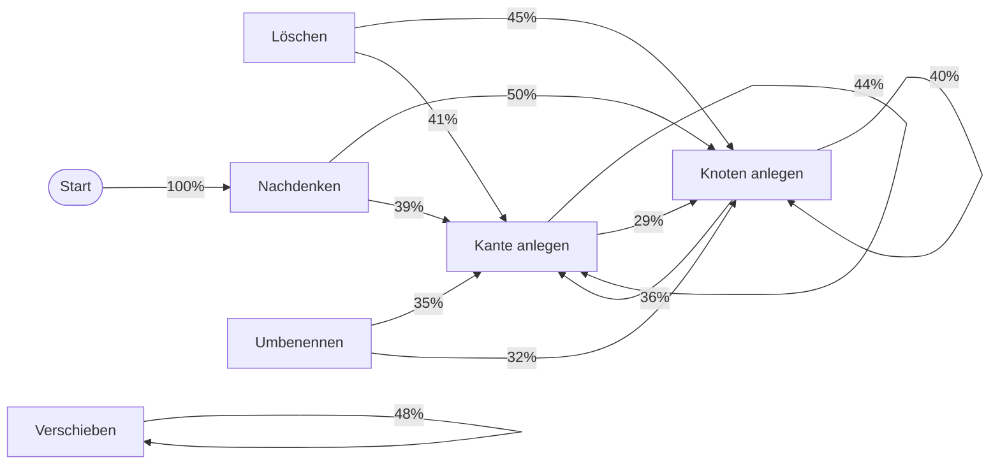

## Zügig und linear

```mermaid
flowchart LR
    n0["Kante anlegen"]
    n1["Knoten anlegen"]
    n2["Löschen"]
    n3["Nachdenken"]
    n4(["Start"])
    n5["Umbenennen"]
    n6["Verschieben"]
    n0 -->|43%| n0
    n0 -->|29%| n1
    n1 -->|40%| n1
    n1 -->|35%| n0
    n2 -->|53%| n1
    n2 -->|33%| n0
    n3 -->|49%| n1
    n3 -->|41%| n0
    n4 -->|100%| n3
    n5 -->|40%| n6
    n5 -->|27%| n0
    n6 -->|61%| n6
```

## Ausprobieren und umbauen

```mermaid
flowchart LR
    n0["Kante anlegen"]
    n1["Knoten anlegen"]
    n2["Löschen"]
    n3["Nachdenken"]
    n4(["Start"])
    n5["Umbenennen"]
    n6["Verschieben"]
    n0 -->|31%| n3
    n0 -->|20%| n6
    n1 -->|33%| n3
    n2 -->|30%| n6
    n2 -->|29%| n1
    n2 -->|22%| n0
    n3 -->|30%| n1
    n3 -->|28%| n0
    n3 -->|25%| n6
    n4 -->|100%| n3
    n5 -->|28%| n6
    n5 -->|26%| n0
    n5 -->|25%| n1
    n6 -->|33%| n6
    n6 -->|24%| n1
    n6 -->|23%| n0
```

## Erst denken, dann modellieren

```mermaid
flowchart LR
    n0["Kante anlegen"]
    n1["Knoten anlegen"]
    n2["Löschen"]
    n3["Nachdenken"]
    n4(["Start"])
    n5["Umbenennen"]
    n6["Verschieben"]
    n0 -->|44%| n0
    n0 -->|29%| n1
    n1 -->|40%| n1
    n1 -->|36%| n0
    n2 -->|45%| n1
    n2 -->|41%| n0
    n3 -->|50%| n1
    n3 -->|39%| n0
    n4 -->|100%| n3
    n5 -->|35%| n0
    n5 -->|32%| n1
    n6 -->|48%| n6
```

